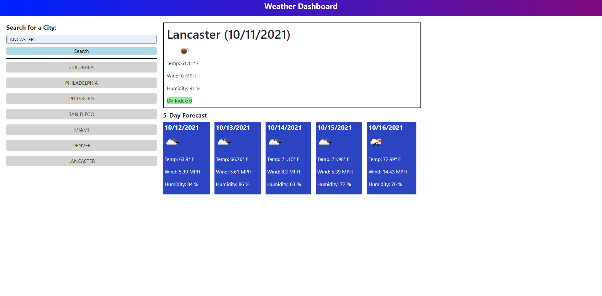

# work-day-scheduler

## Description

Our week 6 homework assignment tasked us with creating a weather dashboard from scratch. The acceptance criteria was a follows: 

-WHEN I search for a city

-THEN I am presented with current and future conditions for that city and that city is added to the search history

-WHEN I view current weather conditions for that city

-THEN I am presented with the city name, the date, an icon representation of weather conditions, the temperature, the humidity, the wind speed, and the UV index

-WHEN I view the UV index

-THEN I am presented with a color that indicates whether the conditions are favorable, moderate, or severe

-WHEN I view future weather conditions for that city

-THEN I am presented with a 5-day forecast that displays the date, an icon representation of weather conditions, the temperature, the wind speed, and the humidity

-WHEN I click on a city in the search history

-THEN I am again presented with current and future conditions for that city

## What I did

In HTML file: 
I created a header, a main elements which contains all contet, an aside which contains a form with label and input field as well as a button to search, a div containing current weather(temp/wind/humidity/uv index/weather icon), and then a h2 tag followed by a section with 5 div elements with each div elements containing weather for each day(date/weather icon/temp/wind/humidity). 

In JS file:
I created variables that related to html elements, an empty array to place searched cities, functions to save the city that was searched to local sotrage, an intial function to display a landing page with no weather content until after a click event occurred which then would display all weather content and add search city to list. I created a function to display weather and get information from a weather api. I made a function with a for loop to create a list of cities searched. Another function was made to add click events for cities in list that were searched previously. I added a error checking code after the click event to prevent a city being saved to local storage or being added to the list if it was already searched.

In CSS:
I adjust sizing, colors, borders, and presentation for content on the page, with most of it being focused on positioning of content on the page. There were classes added that were called in JS when the UV index value was retrieved.

## Finished Product

Here is a screenshot and link to the finished code quiz:
[Link to webpage](https://phalenh.github.io/weather-dashboard/index.html)

